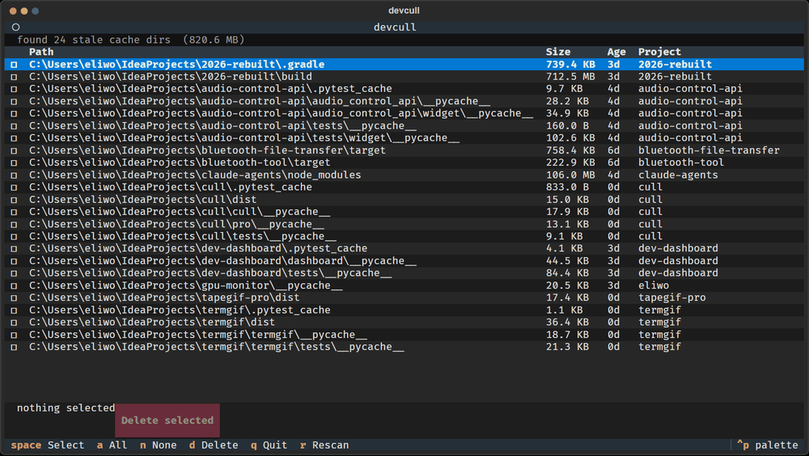

# cull

I ran WinDirStat one afternoon because my SSD was at 94% and found 74 GB of `node_modules` from projects I hadn't touched in over a year. Deleting them by hand is tedious. This does it for you.



```
$ cull ~/projects
found 23 stale cache dirs totaling 61.3 GB

#    path                                        size      last commit
1    ~/projects/old-saas/node_modules           18.2 GB   14mo ago
2    ~/projects/prototype-v2/node_modules        9.4 GB   11mo ago
3    ~/projects/prototype-v2/.next               2.1 GB   11mo ago
...

> a
delete 23 dir(s) (61.3 GB)? [y/N]: y
freed 61.3 GB
```

## install

```
pip install devcull
```

## usage

```
cull [PATH]                  scan PATH (default: current dir)
  --older-than DAYS          only show caches untouched for N days (default: 90)
  --min-size MB              skip caches smaller than N megabytes
  --delete                   interactively pick what to remove
  --all                      delete everything found without asking
  --dry-run                  show what would go, don't touch anything
  --report FILE              write findings to a JSON file
```

## .cullignore

Drop a `.cullignore` file in your projects root to protect specific directories:

```
# keep this one — it's a monorepo with shared deps
my-shared-lib/node_modules

# ignore all .venv dirs
.venv
```

Patterns match against the directory name or its path relative to the scan root.

## what it looks for

- `node_modules`, `.next`, `.nuxt`, `.svelte-kit`, `.parcel-cache`, `.turbo`
- `.venv`, `venv`, `.virtualenv`, `.tox`
- `__pycache__`, `.pytest_cache`, `.mypy_cache`, `.ruff_cache`
- `dist`, `build`, `out` (inside project directories)
- `.gradle`, `.angular`, `.sass-cache`
- `target` (only inside Rust or Maven projects)

## what it won't do

It won't scan for "large files" generically. It won't suggest you delete your Downloads folder or anything outside the above list. The whole point is that it only removes things you can safely recreate by running `npm install` or `pip install` again.

It also won't run automatically or add itself to your startup. You run it when you want to run it.

## "last commit" column

cull tries to find the last git commit in the parent project. If there's no git repo, it falls back to the directory's modification time. The commit date is more reliable — copying files around updates mtime but doesn't change when you actually worked on the project.

## license

MIT
